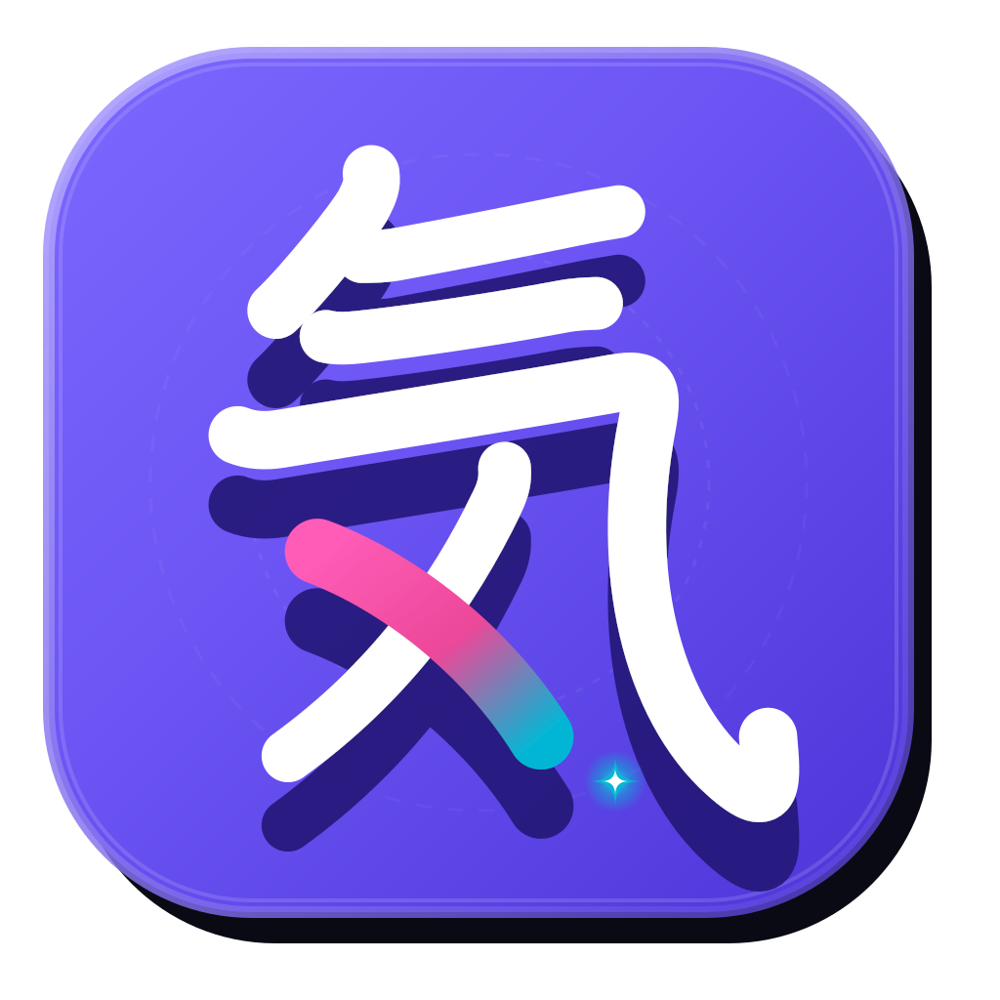

<div align="center">
  
  <h1>KanjiKi (漢字気)</h1>
  <p><strong>A modern, multi-platform spaced-repetition Japanese Kanji learning application</strong></p>
  <p>Offline-first SQLite storage • Stroke-order recognition canvas • Multi-device cloud sync via Supabase</p>
</div>

---

## ✨ Features

- 🧠 **Spaced Repetition System (SRS):** SM-2 algorithm optimized for active recall with customizable daily new and review card quotas.
- ✍️ **Interactive Stroke Order Canvas:** Real-time kanji stroke visualization and canvas drawing recognition.
- 📚 **Comprehensive Kanji Dictionary:** 12,000+ kanji database with Onyomi, Kunyomi, English meanings, radical breakdowns, and JLPT N5–N1 levels.
- 📦 **Deck Management:** Create custom study decks or generate preset JLPT decks (N5 to N1) with one tap.
- 🔄 **Multi-Device Cloud Sync:** Conflict-safe 2-way delta synchronization between local SQLite and cloud Supabase.
- 📱 **Multi-Platform:** Runs seamlessly on Android, iOS, Web (WASM SQLite), Windows, macOS, and Linux.
- 🔒 **Offline-First & Privacy-Respecting:** Works 100% offline out-of-the-box. Cloud sync is optional and protected by Row Level Security (RLS).

---

## 🚀 Quickstart & Development

### 1. Prerequisites
- [Flutter SDK](https://docs.flutter.dev/get-started/install) (3.5.0 or newer)
- Dart SDK 3.5.0+
- Android Studio / Xcode (for mobile development) or Chrome (for Web)

### 2. Clone the Repository
```bash
git clone https://github.com/YOUR_USERNAME/kanjiapp.git
cd kanjiapp
```

### 3. Install Dependencies
```bash
flutter pub get
```

### 4. Configure Environment (Optional for Cloud Sync)
KanjiKi works **completely offline** by default without any cloud configuration.

If you want to test cloud sync with your own Supabase backend:
1. Copy `.env.example` to `.env`:
   ```bash
   cp .env.example .env
   ```
2. Fill in your Supabase project credentials in `.env`:
   ```env
   SUPABASE_URL=https://your-project.supabase.co
   SUPABASE_ANON_KEY=your-anon-key-here
   ```
3. Execute `supabase_schema.sql` in your Supabase SQL Editor to initialize tables and Row Level Security policies.

### 5. Run the App
```bash
# Run on connected device / emulator (Offline / Local)
flutter run

# Run on Web
flutter run -d chrome

# Run with compile-time Supabase keys
flutter run --dart-define=SUPABASE_URL=https://your-project.supabase.co --dart-define=SUPABASE_ANON_KEY=your-anon-key
```

### 6. Run Automated Tests
```bash
flutter test
```

---

## 🏗️ Architecture

- **State & Database:** Local SQLite (`sqflite` on mobile/desktop, `sqflite_common_ffi_web` on web) with initial kanji dictionary bundled in `assets/data/kanji.db`.
- **Cloud Backend:** [Supabase](https://supabase.com) (PostgreSQL, Row Level Security, Auth).
- **Synchronization Engine:** `SyncService` implements last-write-wins delta sync, conflict resolution UI, and atomic transactions.

---

## 📦 Building Releases

### Android APK:
```bash
flutter build apk --release --dart-define=SUPABASE_URL="https://your-project.supabase.co" --dart-define=SUPABASE_ANON_KEY="your-anon-key"
```

### Web Release:
```bash
flutter build web --release --dart-define=SUPABASE_URL="https://your-project.supabase.co" --dart-define=SUPABASE_ANON_KEY="your-anon-key"
```

---

## 🤝 Contributing

Contributions are welcome! Please read [CONTRIBUTING.md](CONTRIBUTING.md) for details on our code of conduct and development workflow.

---

## 🔒 Security

For details on security practices and reporting vulnerabilities, please refer to [SECURITY.md](SECURITY.md).

---

## 📄 License

KanjiKi is open-source software licensed under the **GNU Affero General Public License v3.0 (AGPL-3.0)**. See the [LICENSE](LICENSE) file for more information.
